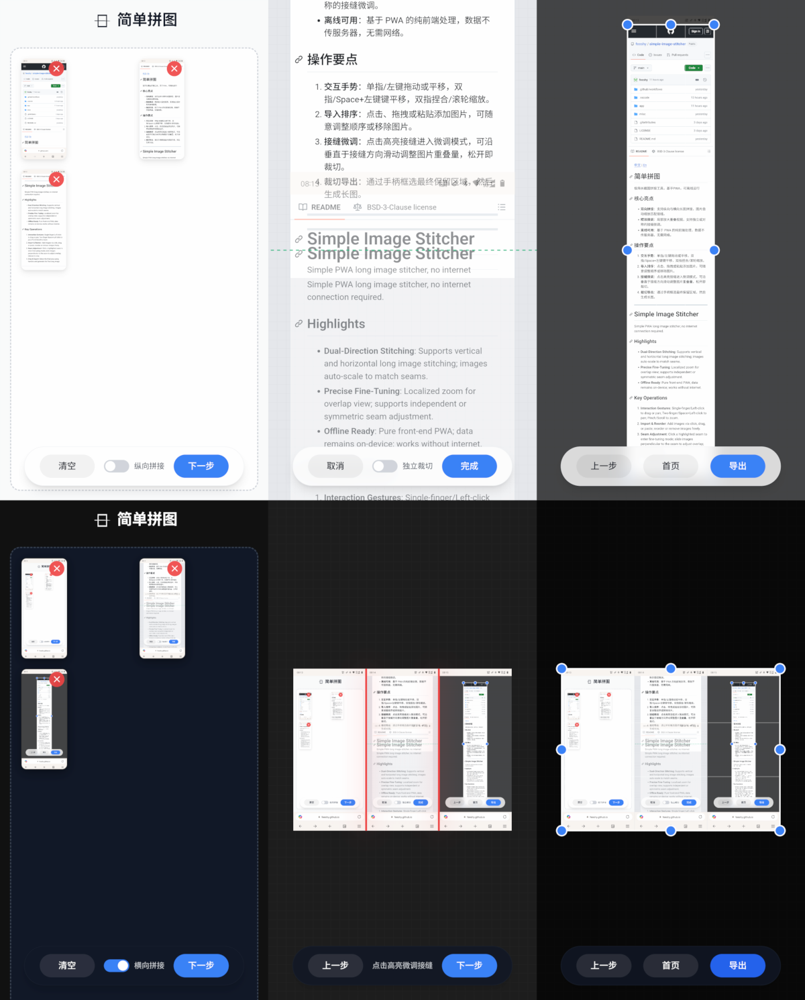

**中文** | [En](#en)

> ⚠️ **仅供本人使用**
> 
> 本项目基于开源项目 [simple-image-stitcher](https://github.com/feeshy/simple-image-stitcher) 进行个人定制和优化，主要用于满足本人的图片拼接需求。

# [索的拼图](https://lqjqtd.github.io)

极简长截图拼接工具，基于 PWA，可离线运行

## 核心亮点

- **双向拼接**：支持纵向与横向长图拼接，图片自动缩放匹配接缝。
- **精准微调**：点击红线进入局部放大视图，支持独立或对称的接缝微调。
- **离线可用**：基于 PWA 的纯前端处理，数据不传服务器，无需网络。
- **移动端优化**：针对安卓手机浏览器深度适配，支持安全区、刘海屏、手势导航。

## 操作要点

- **交互手势**：单指/左键拖动或平移，双指/Space+左键平移，双指捏合/滚轮缩放。

1. **导入排序**：点击、拖拽或粘贴添加图片，可随意调整顺序或移除图片，使用开关选择纵向或横向拼接。
2. **接缝微调**：点击红线进入微调模式，沿垂直于接缝方向滑动调整图片重叠量，松开即裁切。支持独立裁切和对称裁切两种模式。
3. **裁切导出**：通过手柄框选最终保留区域，点击导出保存长图。

## 浏览器兼容性

| 功能 | Chrome | 夸克 | 小米浏览器 | 华为浏览器 |
|---|---|---|---|---|
| 核心拼接功能 | ✅ | ✅ | ✅ | ✅ |
| 离线模式 | ✅ | ✅ | ✅（需清除缓存） | ✅ |
| 添加到桌面 | ✅ | ❌ | ❌ | ⚠️（手动添加） |
| Web Share API | ✅ | ✅ | ❌ | ❓ |

## 部署说明

### GitHub Pages（推荐）

项目已部署至 GitHub Pages，直接访问：https://lqjqtd.github.io

### 群辉 NAS（Web Station）

1. 将 `app/` 目录内容复制到 Web Station 文档根目录（如 `/volume1/web/stitcher/`）
2. **必须配置 HTTPS**：PWA 功能（离线模式、Service Worker）需要 HTTPS
3. 手动更新时修改 `sw.js` 中的 `VERSION` 常量触发缓存更新
4. 不要上传 `_tmp_sw.js` 文件

---

[中文](#zh) | **En**

> ⚠️ **Personal Use Only**
> 
> This project is based on the open source project [simple-image-stitcher](https://github.com/feeshy/simple-image-stitcher), customized and optimized for personal use.

# [Simple Image Stitcher](https://lqjqtd.github.io)

Simple PWA long image stitcher, no internet connection required.

## Highlights

- **Dual-Direction Stitching**: Supports vertical and horizontal long image stitching; images auto-scale to match seams.
- **Precise Fine-Tuning**: Tap the red line to enter fine-tuning mode; supports independent or symmetric seam adjustment.
- **Offline Ready**: Pure front-end PWA; data remains on-device; works without internet.
- **Mobile Optimized**: Deeply optimized for Android mobile browsers, including safe area, notch screen, and gesture navigation.

## Key Operations

1. **Interaction Gestures**: Single-finger/Left-click to drag or pan; Two-finger/Space+Left-click to pan; Pinch/Scroll to zoom.
2. **Import & Reorder**: Add images via click, drag, or paste; reorder or remove images freely. Use the toggle to choose vertical or horizontal stitching.
3. **Seam Adjustment**: Tap the red line to enter fine-tuning mode; slide perpendicular to the seam to adjust overlap; release to crop. Supports independent and symmetric cropping modes.
4. **Crop & Export**: Select the final area using handles and export the long image.

## Browser Compatibility

| Feature | Chrome | Quark | Xiaomi Browser | Huawei Browser |
|---|---|---|---|---|
| Core Stitching | ✅ | ✅ | ✅ | ✅ |
| Offline Mode | ✅ | ✅ | ✅ (clear cache first) | ✅ |
| Add to Home Screen | ✅ | ❌ | ❌ | ⚠️ (manual) |
| Web Share API | ✅ | ✅ | ❌ | ❓ |

## Deployment

### GitHub Pages

Already deployed: https://lqjqtd.github.io

### Synology NAS (Web Station)

1. Copy contents of `app/` directory to Web Station document root (e.g., `/volume1/web/stitcher/`)
2. **HTTPS is required**: PWA features (offline mode, Service Worker) require HTTPS
3. Increment `VERSION` constant in `sw.js` for cache invalidation on manual updates
4. Do not upload `_tmp_sw.js`

---

*Built with ❤️ for mobile-first image stitching*